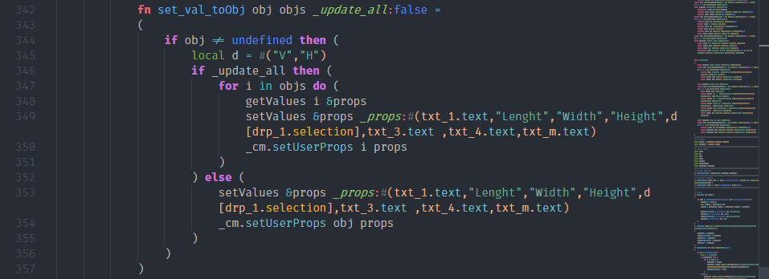
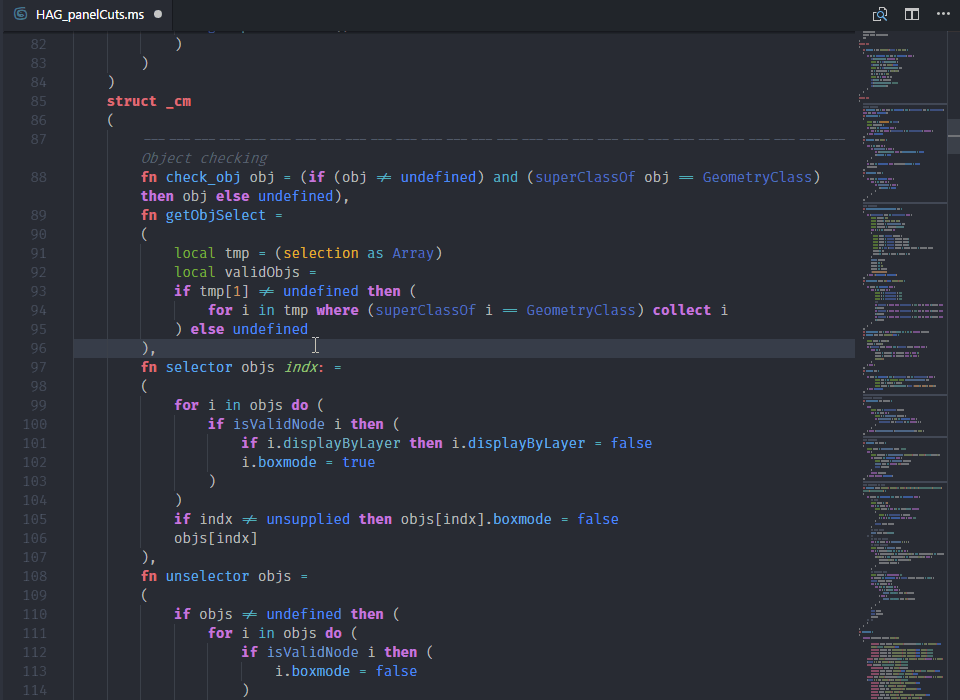
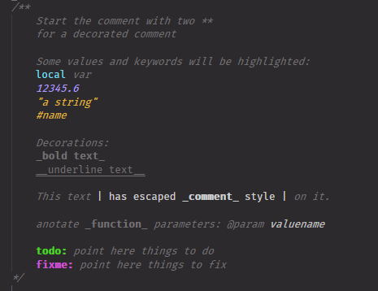

# MaxScript language support

Autodesk 3ds Max Scripting language (MaxScript) support.

## Features

- Syntax highlight.
- Grammar Error checking
- Semantic syntax highlight
- Code autocompletion for keywords, primitives, generic functions, structs, interfaces and classes.
- Snippets for most used code blocks.
- Go to Symbol in document (Basic support, somewhat buggy).
- Go to Definition and peek definition in document.
- Code formatter
- Code minify
- Code prettifier
- Help command (*MaxScript help. Accessible from the right-click menu.*): Select a keyword and open related online documentation.





## Release Notes

[Changelog](./CHANGELOG.md)

## Requirements

None.

## Extension Settings

```json
  "maxscript.completions": true | false,
  "maxscript.gotosymbol": true | false,
  "maxscript.gotodefinition": true | false,
  "maxscript.semantics": true | false,
  "maxscript.helpprovider": string,
```

## Syntax Highlight inside comments



## Syntax Highlight

Basic settings for **Custom highlighting**.

There is a list of available scopes [here](./TextMate-scopes.md), and some example rules [here](./tokenColorCustomizations-example.jsonc)

```jsonc
  /*
  * Syntax highlight options for language maxscript
  */
  "editor.tokenColorCustomizations": {
    "textMateRules": [
      {
        "name": "Todo",
        "scope": "documentation.todo.mxs",
        "settings": { "foreground": "#4bd621", "fontStyle": "bold" }
      },
      {
        "name": "Fixme",
        "scope": "documentation.fixme.mxs",
        "settings": { "foreground": "#ce55d3", "fontStyle": "bold" }
      },
      {
        "name": "Plain text",
        "scope": "documentation.plain.mxs",
        "settings": { "foreground": "#cecece", "fontStyle": ""}
      },
      //...
    ]
  },
```

## Executing MaxScript

MXSPyCOM project allow for editing & execution of 3ds Max MaxScript and Python files from external code editors.

- Get it here: [MXSPyCOM by Jeff Hannna](https://github.com/JeffHanna/MXSPyCOM)
- Follow the configuration guide to register the COM server.
- Set up a vscode task:

```json
{
    "version": "2.0.0",
    "tasks": [
      {
        "label": "MXSPyCOM execute Script",
        "type": "shell",
        // Add MXSPyCOM.exe to PATH or use file root, i.e: "C:/MXSPyCOM/MXSPyCOM.exe"
        "command":".\\MXSPyCOM.exe",
        "args": [
            "-s",
            { "value": "${file}", "quoting": "strong" }
        ],
        "group": "test",
        "presentation": {
            "echo": true,
            "reveal": "silent",
            "focus": false,
            "panel": "shared"
        }
    }
  ]
}
```

- run the task, enjoy the 3ds max listener catching errors.

## Contribute

[gitHub](https://github.com/HAG87/vscode-maxscript)

>Note: MaxScript Structure is to say at least, chaotic. I've done my best to organize structs, classes, interfaces and so on. However the grammar is usable enough.
