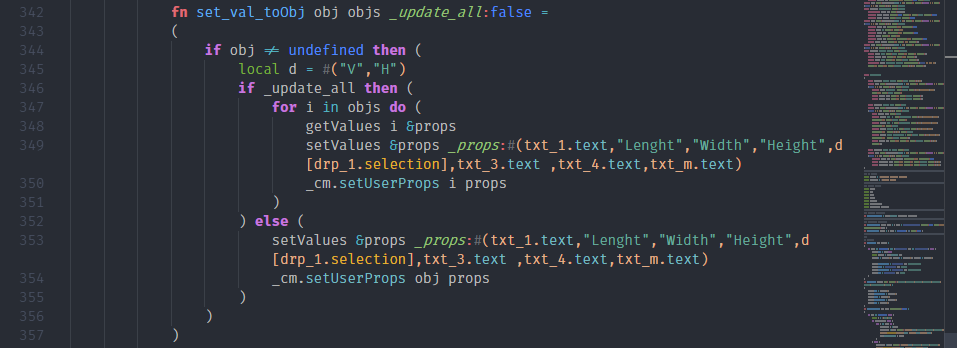
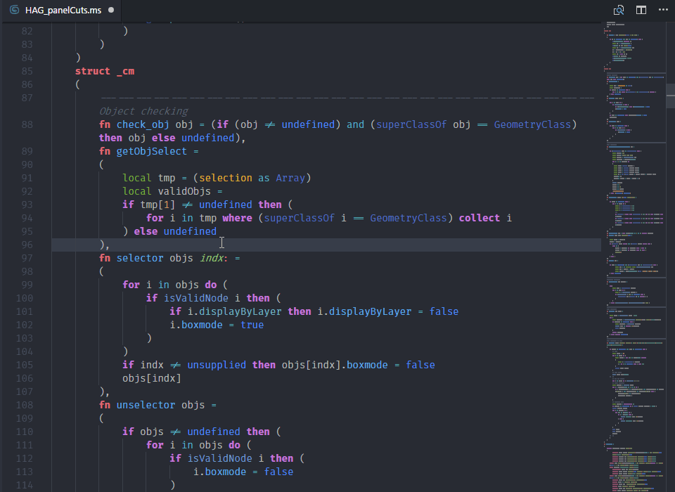
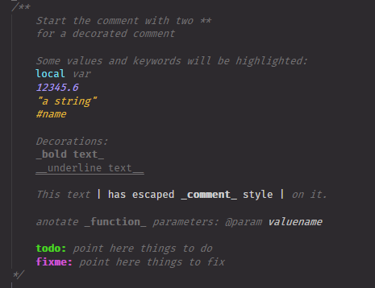

# MaxScript language support

Autodesk 3ds Max Scripting language (MaxScript) support.

## Features

- TextMate syntax highlighting for .ms and .mcr files
- Parser diagnostics (grammar and syntax errors)
- Semantic tokens (document and range)
- Completion (built-in database + code-aware suggestions)
- Document symbols (outline)
- Workspace symbols
- Go to Definition
- Find All References
- Rename Symbol
- Hover information
- Document highlights
- Signature Help
- Linked editing ranges
- Folding ranges
- Call hierarchy
- CodeLens
- Document formatting and range formatting
- Minify commands (open document, multi-file)
- Prettify commands (open document, single file)
- Help lookup command
- Snippets

### Language intelligence notes

- Core navigation and symbol features are AST-first.
- Contextual semantic tokens can be toggled with a provider setting for performance tuning.

### Known limitations

Implementing a solution for these limitations will require a full interpreter:

- Renaming a parameter in a function definition, will not rename the parameter on function calls
- Parameters in a function call that have the same name that a parameter in a containing function will refer to that parameter instead of the caller function
- Functions and struct members with the same name will not be properly matched when requesting the definition, references and rename from a property access or call





## Extension Settings

Most settings are under the maxScript section.

```json
  "maxScript.help.provider": "https://help.autodesk.com/view/MAXDEV/2025/ENU/",

  "maxScript.providers.dataBaseCompletion": true,
  "maxScript.providers.codeCompletion": true,
  "maxScript.providers.astSymbolProvider": true,
  "maxScript.providers.definitionProvider": true,
  "maxScript.providers.referenceProvider": true,
  "maxScript.providers.hoverProvider": true,
  "maxScript.providers.renameProvider": true,
  "maxScript.providers.documentHighlightProvider": true,
  "maxScript.providers.signatureHelpProvider": true,
  "maxscript.providers.linkedEditingRangeProvider": true,
  "maxscript.providers.foldingRangeProvider": true,
  "maxscript.providers.codeLensProvider": true,
  "maxscript.providers.callHierarchyProvider": true,
  "maxscript.providers.workspaceSymbolProvider": true,
  "maxscript.providers.contextualSemanticTokens": true,
  "maxScript.providers.tracePerformance": false,
  "maxScript.providers.traceRouting": false,
  "maxScript.providers.traceParserDecisions": false,

  "maxScript.parser.reparseDelay": 300,

  "maxScript.formatter.indentChar": "\\t",
  "maxScript.formatter.newLineChar": "\\r\\n",
  "maxScript.formatter.codeblock.parensInNewLine": true,
  "maxScript.formatter.codeblock.newlineAllways": false,
  "maxScript.formatter.codeblock.spaced": true,
  "maxScript.formatter.statements.useLineBreaks": true,
  "maxScript.formatter.statements.optionalWhitespace": false,
  "maxScript.formatter.list.useLineBreaks": false,

  "maxScript.minifier.filePrefix": "min_",
  "maxScript.minifier.removeUnnecessaryScopes": false,
  "maxScript.minifier.condenseWhitespace": true,

  "maxScript.prettifier.filePrefix": "pretty_",
  "maxScript.prettifier.expressionsToBlock": true
}
```

## Commands

- MaxScript: Code reference...
- MaxScript: Minify open document
- MaxScript: Minify files...
- MaxScript: Prettify open document
- MaxScript: Prettify file

## Custom Tasks (Published Extension)

The extension contributes a custom task type: maxscript.

Supported task values:

- minify
- prettify

Optional task properties:

- patterns: array of glob patterns (relative to workspace folder)
- continueOnError: continue processing when a file fails

Example .vscode/tasks.json:

```json
{
  "version": "2.0.0",
  "tasks": [
    {
      "label": "mxs: minify src",
      "type": "maxscript",
      "task": "minify",
      "patterns": ["src/**/*.{ms,mcr}"],
      "continueOnError": true
    },
    {
      "label": "mxs: prettify src",
      "type": "maxscript",
      "task": "prettify",
      "patterns": ["src/**/*.{ms,mcr}"],
      "continueOnError": true
    }
  ]
}
```

## Syntax Highlight inside comments



## Syntax Highlight

Basic settings for custom highlighting.

Available references:

- [TextMate scopes list](./TextMate-scopes.md)
- [Token color customization examples](./tokenColorCustomizations-example.jsonc)

```jsonc
  /*
  * Syntax highlight options for language maxscript
  */
  "editor.tokenColorCustomizations": {
    "textMateRules": [
      {
        "name": "Todo",
        "scope": "documentation.todo.mxs",
        "settings": { "foreground": "#4bd621", "fontStyle": "bold" }
      },
      {
        "name": "Fixme",
        "scope": "documentation.fixme.mxs",
        "settings": { "foreground": "#ce55d3", "fontStyle": "bold" }
      },
      {
        "name": "Plain text",
        "scope": "documentation.plain.mxs",
        "settings": { "foreground": "#cecece", "fontStyle": ""}
      }
      // ...
    ]
  }
```

## Executing MaxScript

MXSPyCOM project allows editing and execution of 3ds Max MaxScript and Python files from external code editors.

- Get it here: [MXSPyCOM by Jeff Hannna](https://github.com/JeffHanna/MXSPyCOM)
- Follow the configuration guide to register the COM server.
- Set up a VS Code task:

```json
{
  "version": "2.0.0",
  "tasks": [
    {
      "label": "MXSPyCOM execute Script",
      "type": "shell",
      "command": ".\\MXSPyCOM.exe",
      "args": [
        "-s",
        { "value": "${file}", "quoting": "strong" }
      ],
      "group": "test",
      "presentation": {
        "echo": true,
        "reveal": "silent",
        "focus": false,
        "panel": "shared"
      }
    }
  ]
}
```

- Run the task to execute script content and inspect errors in the 3ds Max listener.

## Release Notes

[Changelog](./CHANGELOG.md)

## Requirements

None.

## Contribute

[gitHub](https://github.com/HAG87/vscode-maxscript-lsp)

> Note: MaxScript structure is, to say the least, chaotic. The project organizes symbols and grammar handling pragmatically; contributions are welcome.
